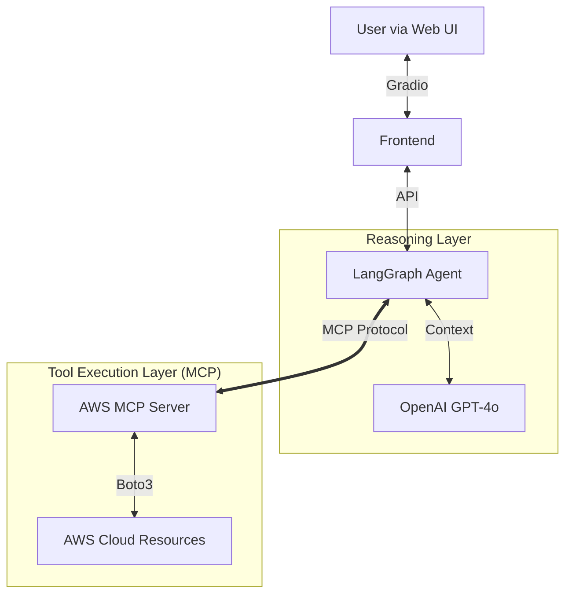

# 🛡️ Guardian: Autonomous Cloud Security Agent

> **An intelligent, human-in-the-loop AI agent that audits, detects, and actively remediates AWS cloud security vulnerabilities using the Model Context Protocol (MCP).**

[](https://opensource.org/licenses/MIT)
[](https://www.python.org/downloads/release/python-3100/)
[](https://www.docker.com/)
[](https://langchain-ai.github.io/langgraph/)
[](https://modelcontextprotocol.io/)

---

## 🎥 Demo

**[Watch the 60-Second Walkthrough Video Here]** *(Replace this with your Loom link)*


*(The agent detecting a public S3 bucket and requesting permission to fix it.)*

---

## 🚀 Overview

Guardian is a next-generation **Agentic Security System** built on the **Model Context Protocol (MCP)**. Unlike traditional scripts that hardcode API calls, Guardian decouples the "Brain" (AI) from the "Tools" (AWS).

It connects to a dedicated **AWS MCP Server**, identifies high-risk misconfigurations (e.g., Public S3 Buckets, Unused EC2 Instances), and engages in a **Human-in-the-Loop** workflow to fix them.

### **Key Capabilities**

* **🔌 MCP Architecture:** Uses the Model Context Protocol to standardize tool usage, making the agent modular and secure.
* **🔍 Autonomous Scanning:** Proactively audits AWS S3, IAM, and EC2 resources via the MCP Server.
* **🧠 Intelligent Reasoning:** Uses LangGraph to determine if a configuration is a feature or a bug.
* **🛡️ Active Remediation:** Can fix vulnerabilities (e.g., `BlockPublicAccess`) upon user approval.
* **💬 Natural Language Interface:** Chat with your infrastructure (e.g., *"Why is my bill high?"*)

---

## 🏗️ Architecture

Guardian uses a decoupled architecture where the Agent communicates with AWS tools strictly through the **MCP Protocol**. This ensures the AI reasoning layer is isolated from direct API implementation details.


### Tech Stack

* **Protocol:** Model Context Protocol (MCP) - Standardizes tool connections
* **Core Logic:** Python, LangChain, LangGraph
* **LLM:** OpenAI GPT-4o
* **Cloud Interface:** AWS SDK (Boto3) wrapped in an MCP Server
* **Frontend:** Gradio (Web Dashboard)
* **Deployment:** Docker, AWS EC2
* **Security:** IAM Roles (No hardcoded keys)

---

## ☁️ Deployment Strategy (AWS EC2)

This project was deployed using a Cloud-Native approach on AWS. Instead of running locally, the agent lives inside a Docker container on an EC2 instance, ensuring 24/7 availability.

### Infrastructure Setup

* **Compute:** AWS EC2 Instance (`t2.micro` / Ubuntu 22.04 LTS)
* **Security (IAM Role):** Attached `Guardian-Role` with `AmazonS3ReadOnlyAccess` and `AmazonEC2ReadOnlyAccess` policies. This ensures Zero-Trust security—no AWS Access Keys are stored on the server
* **Security Groups:** Inbound traffic restricted to Port 7860 (App) and 22 (SSH)
* **Containerization:** Dockerized to resolve dependency conflicts (`langchain`, `boto3`, `mcp`) and ensure consistency across environments

### Deployment Commands
```bash
# 1. Update the instance
sudo apt update && sudo apt install docker.io -y

# 2. Clone the repository
git clone https://github.com/avi-sh712/guardian-agent.git
cd guardian-agent

# 3. Build the Docker Image
docker build -t guardian .

# 4. Run in Background (Daemon Mode)
# Note: AWS credentials are auto-injected via the IAM Role
docker run -d \
  -p 7860:7860 \
  -e OPENAI_API_KEY="sk-proj-..." \
  -e AWS_DEFAULT_REGION="us-east-1" \
  --restart always \
  guardian
```

---

## ⚡ Quick Start (Run Locally)

### Prerequisites

* Docker installed
* An OpenAI API Key
* AWS Credentials configured (`~/.aws/credentials`)

### Steps

**1. Clone the Repository**
```bash
git clone https://github.com/avi-sh712/guardian-agent.git
cd guardian-agent
```

**2. Run with Docker**
```bash
docker build -t guardian .
docker run -d -p 7860:7860 -e OPENAI_API_KEY="your-key" guardian
```

**3. Access the Dashboard**

Open `http://localhost:7860` in your browser.

---

## 🛡️ Security & Design Decisions

* **MCP Tool Isolation:** Boto3 logic is encapsulated within the MCP Server, preventing the LLM from executing arbitrary code—it can only call defined tools
* **Zero-Trust Architecture:** The agent cannot execute write actions (e.g., deleting a bucket) without explicit human confirmation in the UI
* **IAM Role-Based Access:** By deploying on EC2 with an IAM Role, we avoid managing long-term credentials (`AWS_ACCESS_KEY_ID`), significantly reducing the attack surface

---

## 🔮 Roadmap (Future Improvements)

Currently, Guardian is a high-security internal tool. The roadmap focuses on scaling it to a multi-tenant SaaS product.

- [ ] **Infrastructure as Code (IaC):** Automate the EC2 and IAM provisioning using Terraform or AWS CDK
- [ ] **Multi-Tenancy:** Implement a PostgreSQL database to support multiple user accounts and audit logs
- [ ] **RAG Integration:** Add a "Knowledge Base" feature where the Agent can read AWS Documentation (via RAG) to explain why a vulnerability is dangerous
- [ ] **Push Notifications:** Integrate with Slack/Discord Webhooks for real-time alerting

---

## 🤝 Contributing

Contributions are welcome! Please open an issue or submit a pull request.

---

## 📄 License

This project is licensed under the MIT License - see the [LICENSE](LICENSE) file for details.

---

## 📧 Contact

**Author:** Avi Sharma  
**GitHub:** [@avi-sh712](https://github.com/avi-sh712)  
**Project Link:** [https://github.com/avi-sh712/guardian-agent](https://github.com/avi-sh712/guardian-agent)